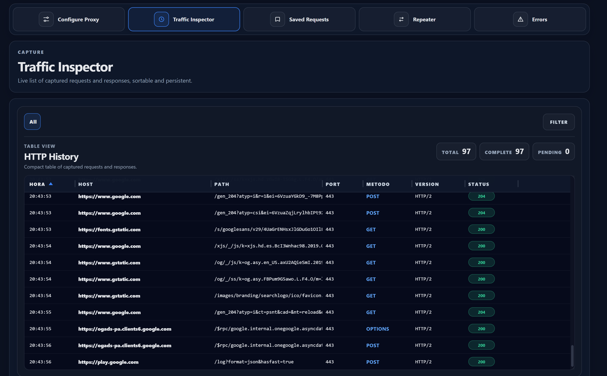
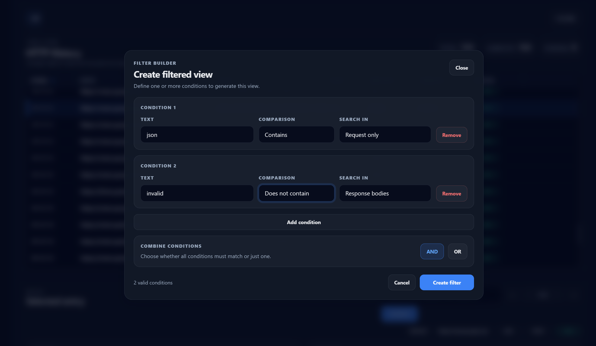
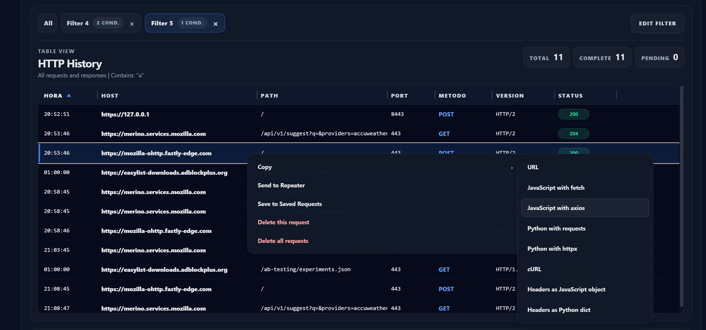
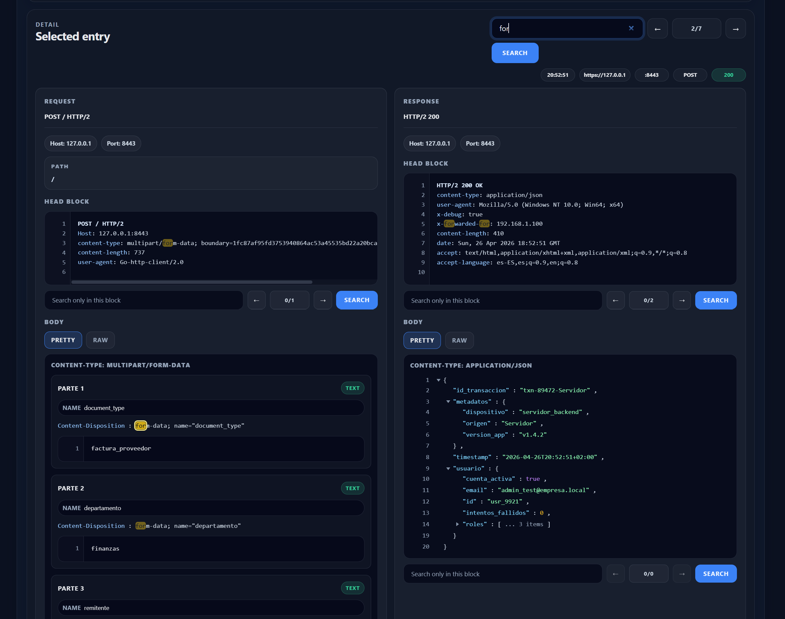
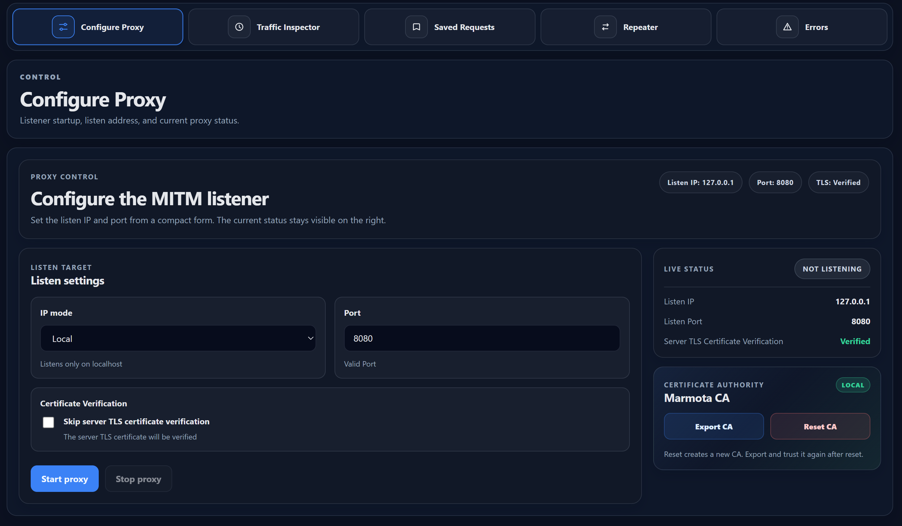

# Marmota


Marmota is a cross-platform, high-performance Man-in-the-Middle (MITM) proxy and HTTP/HTTPS traffic analyzer. Built to capture, inspect, and manipulate HTTP/1.1 and HTTP/2 traffic, it provides developers and security engineers with deep visibility into network interactions between clients and servers.

## Tech Stack
* **Backend:** Go (Golang)
* **Frontend:** Svelte (Assisted by OpenAI Codex)
* **Framework:** Wails (Cross-platform desktop application binding)

*Note: The frontend UI is currently transitioning from Spanish to English. You may encounter minor localization inconsistencies in the current build.*

## 📥 Download
You can download the latest executable binaries for Windows, Linux, and macOS from the [Releases page](https://github.com/BoolerLogic/Marmota/releases).

---

## Core Features

### 🔍 Traffic Interception & Inspection
Marmota acts as a local proxy, capturing all routed requests and responses. The interface provides detailed introspection of headers, payloads, and connection metadata.



### 🚀 High-Performance Backend Filtering
Unlike tools that filter data in the DOM, Marmota's filtering engine runs natively in the Go backend for maximum efficiency. 
* **Tab-based Workflow:** Every applied filter generates a new discrete tab, allowing you to maintain context and switch between different filtered views and the main HTTP history without losing state.
* **Granular Conditions:** `Contains`, `Does not contain`, `Exactly equals`, `Does not exactly equal`, `Starts with`, `Ends with`.
* **Deep Targeting:** Apply logic to specific HTTP components: `Request/Response`, `Headers`, `Bodies`, `Method`, `Host`, `Port`, `Scheme`, or `Path`.
* **Boolean Logic:** Chain multiple conditions using `AND` / `OR` operators.



### 🧩 Advanced Snippet Export
Easily replicate captured requests across different environments. Marmota parses the captured raw request and instantly generates ready-to-use code snippets:
* **Raw:** URL, cURL commands.
* **JavaScript:** `fetch` API, `axios`, or standalone Header objects.
* **Python:** `requests`, `httpx`, or standalone Dictionary headers.



### 🎨 Intelligent Payload Formatting (Pretty Print)
When inspecting HTTP requests or responses, Marmota automatically detects common payload structures (`application/json`, `text/html`, `application/x-www-form-urlencoded`, and `multipart/form-data`). It applies real-time syntax highlighting and structural indentation (Pretty Print) to transform raw data into a highly readable, developer-friendly format.

### 🎯 Scoped Search & Highlighting
Navigate massive payloads effortlessly with the built-in inspection search engine. When a specific entry is selected, you can search for strings with instant visual text highlighting. The search scope is fully adjustable to reduce noise:
* **Global Search:** Scans the entire entry (Request + Response).
* **Targeted Search:** Isolates the query strictly to specific components: `Request Head`, `Request Body`, `Response Head`, or `Response Body`.



### 🔁 Request Repeater
Send intercepted requests to the Repeater module to modify parameters, headers, or bodies and replay them against the server. The module includes basic syntax validation, surfacing warnings and errors for malformed HTTP requests prior to execution.

### 💾 Volatile Session Storage (Saved Requests)
Bookmark critical requests in the "Saved Requests" tab. This acts as a persistent list during your current session, isolating important traffic from the main HTTP History log. *Note: This is volatile storage; data is cleared upon application exit.*

---

## Network & Security Configuration



### CA Certificate Installation
To decrypt and inspect HTTPS traffic, Marmota generates a local Certificate Authority (CA). For the proxy to function correctly, this CA certificate **must** be installed and trusted either at the OS level (Keychain/Certificate Manager) or directly within the client browser's certificate store. 

### TLS Verification Bypass
Marmota includes an option to bypass upstream X.509 certificate validation (equivalent to `InsecureSkipVerify` in Go). 
* **Use Case:** This is strictly necessary when proxying traffic to a server utilizing a self-signed certificate, an expired certificate, or a local development environment lacking a globally trusted CA. Without enabling this feature, the TLS handshake between Marmota and the upstream server will fail, preventing the connection.

### Listener Binding
Configure the proxy by specifying a listening port and binding it to:
* `localhost` (127.0.0.1) for local-only traffic.
* A specific network interface IP.
* All interfaces (`0.0.0.0`) to capture traffic from external devices on the same LAN.

---

## Build & Installation

### Prerequisites
* [Go](https://golang.org/dl/) (1.24+)
* [Node.js](https://nodejs.org/) & npm (for Svelte)
* [Wails CLI](https://wails.io/docs/gettingstarted/installation)


### Build Instructions

1. Clone the repository:
   ```bash
   git clone https://github.com/BoolerLogic/marmota.git
   cd marmota
   ```

2. Build the application for your current OS:
   ```bash
   wails build
   ```
   *The compiled binary will be located in the `build/bin/` directory.*

### Development Mode
To run Marmota in development mode with hot-reloading:
```bash
wails dev
```

---

## License
This project is licensed under the MIT License - see the [LICENSE](LICENSE) file for details.
